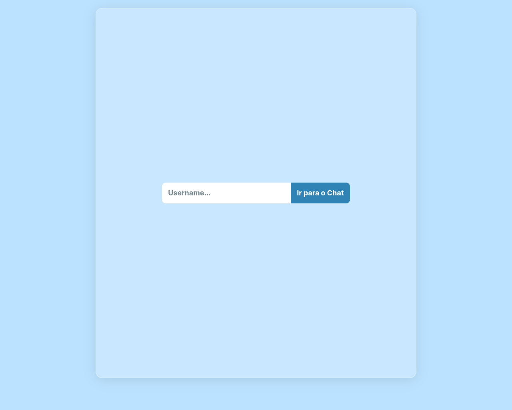
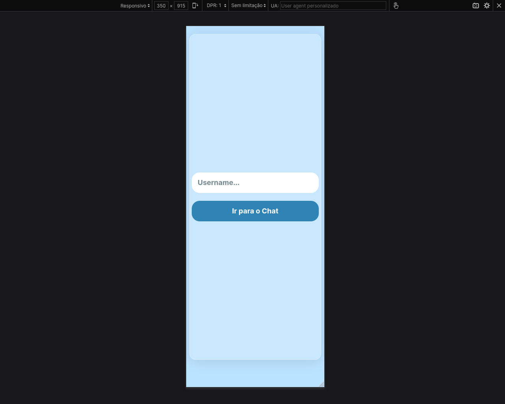
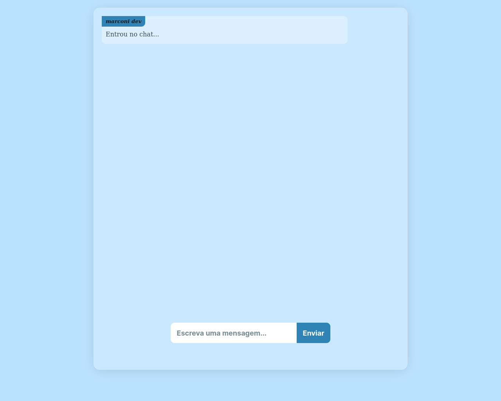
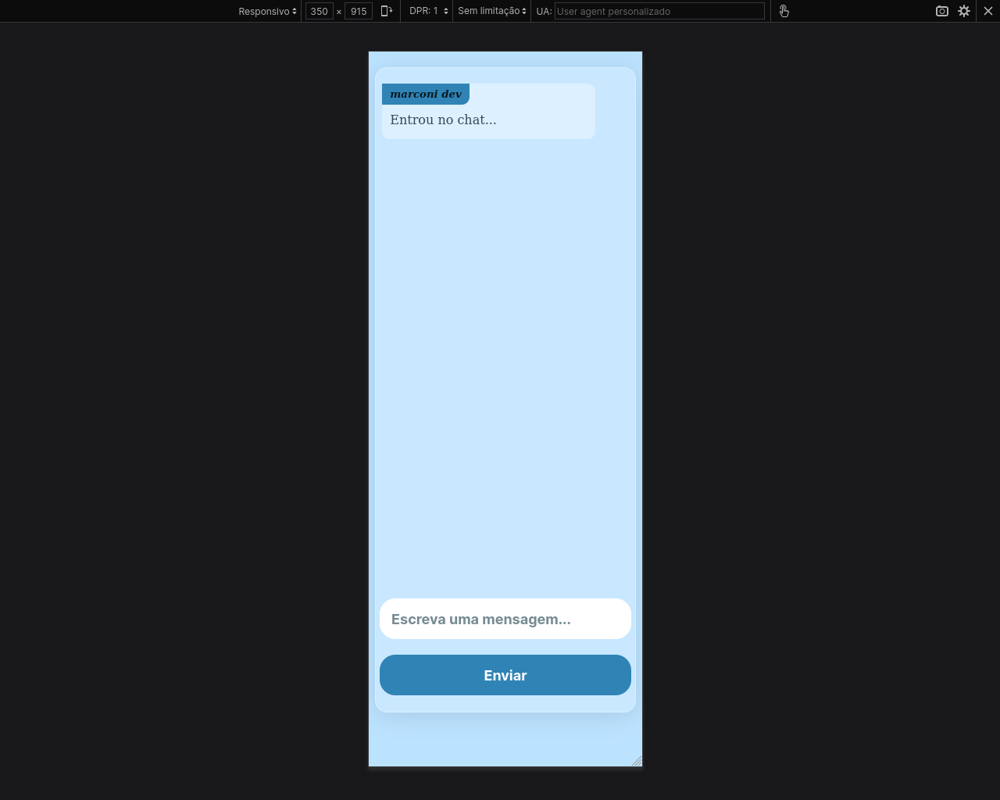

# chat
Uma SPA com comunicação em tempo real criada com Django
## Acesse em: <a href="https://django-chat.up.railway.app">Django Chat</a>

## Imagens
* Escolha um nome de usuário

* Entre no chat

## Tecnologias utilizadas:
* Django
* Redis
* Channels
* Protocolo Websocket
* Javascript
* HTML/CSS
