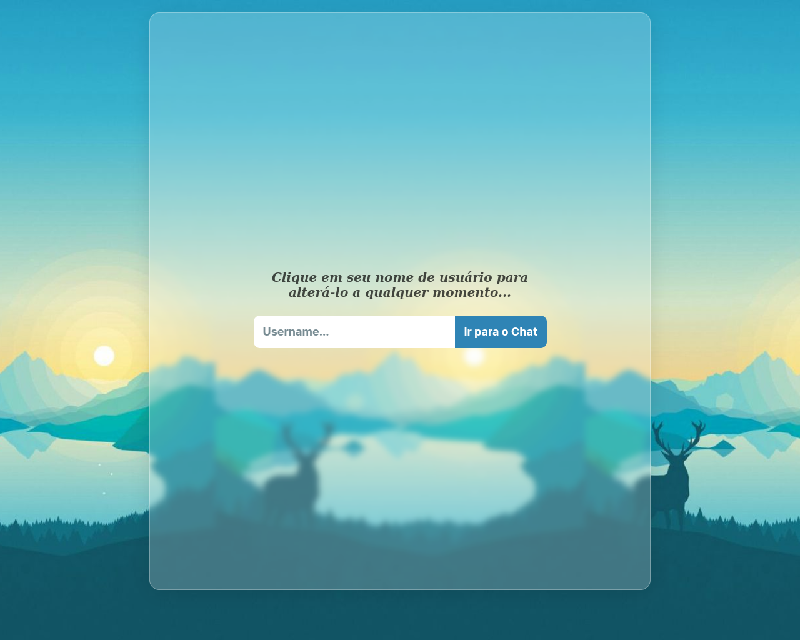

# Django Chat
Django Chat é uma SPA (Single Page Application) que utiliza o framework Django para oferecer aos usuários uma plataforma de comunicação em tempo real. <br>
Acesse em: <a href="https://django-chat.up.railway.app">Django Chat</a>




## Instalação:
- Clone este projeto e vá para o diretório raiz.
- Crie e ative um ambiente virtual: 
    ```
    python3 -m venv venv
    source venv/bin/activate
    ```
- Instale as dependências:
    ```
    pip install -r requirements.txt
    ```
- Para configurar as variáveis de ambiente da aplicação, é necessário criar um arquivo chamado .env na pasta core/core. Esse arquivo deve conter as seguintes informações:
    * SECRET_KEY=<sua_secret_key>
    * DEGUB=<True | False>
    * WS_URL=<url_do_websocket | ws://localhost:8000/ws/chat/>
    * REDIS_URL=<url_do_redis>
- Caso DEBUG=False:
    ```
    cd core
    python manage.py collectstatic
    ```
- Inicie o servidor:
    ```
    cd core
    python manage.py runserver
    ```

## Tecnologias
### Django
O Django é responsável por estabelezer a conexão pelo protocolo websocket e retornar uma view contendo o hmtl, css e o JavaScript. 
### Channels
Channels é a biblioteca utilizada para criar aplicações com comunicação em tempo real usando o Django. A aplicação é servida com o Daphne.
### JavaScript
O projeto é uma SPA, com isso, o JavaScript é responsável por todo o conteúdo renderizado, além de manter comunicação com o websocket.
### Redis
O Redis é utilizado no Channels para armazenar grupos. No caso do Django Chat, armazena um único grupo com todos os usuários.
